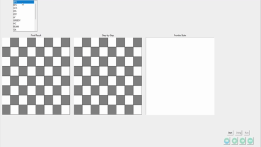
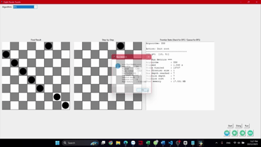
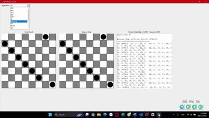
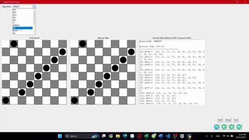
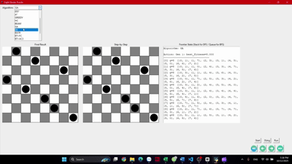
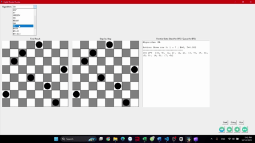
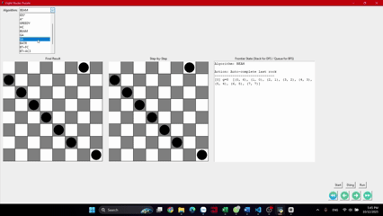
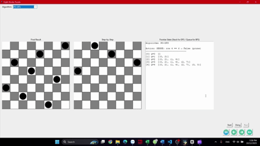
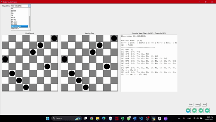
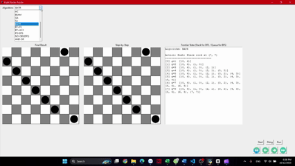

<h1 align="center">♜ 8-Rooks Visualizer with AI Algorithms</h1>

  
<b>Đồ án cá nhân Trí tuệ Nhân tạo</b> 
  <b>Sinh viên thực hiện:</b> Phan Phúc Hậu — <b>MSSV:</b> 23110097 
  <b>Giảng viên hướng dẫn:</b> TS. Phan Thị Huyền Trang

<h2>🧭 Mục lục</h2>
<ul>
  <li><a href="#giới-thiệu">Giới thiệu</a></li>
  <li><a href="#mục-tiêu">Mục tiêu</a></li>
  <li><a href="#nội-dung-dự-án">Nội dung dự án</a></li>
  <li><a href="#thuật-toán">Thuật toán</a>
    <ul>
      <li><a href="#31-tìm-kiếm-không-thông-tin-uninformed-search">3.1. Tìm kiếm không thông tin (Uninformed Search)</a></li>
      <li><a href="#32-tìm-kiếm-có-thông-tin-informed-search">3.2. Tìm kiếm có thông tin (Informed Search)</a></li>
      <li><a href="#33-tìm-kiếm-cục-bộ-local-search">3.3. Tìm kiếm cục bộ (Local Search)</a></li>
      <li><a href="#34-tìm-kiếm-trong-môi-trường-phức-tạp-complex-environment-search">3.4. Tìm kiếm trong môi trường phức tạp</a></li>
      <li><a href="#35-tìm-kiếm-có-điều-kiện-ràng-buộc-constraint-satisfaction-problem">3.5. Bài toán ràng buộc (CSP)</a></li>
    </ul>
  </li>
  <li><a href="#tham-khao">Tài liệu tham khảo</a>
</ul>

<h2 id="giới-thiệu">Giới thiệu</h2>

<b>8-Rooks</b> là một bài toán kinh điển trong Trí tuệ Nhân tạo, yêu cầu đặt 8 quân Xe lên bàn cờ 8×8 sao cho
không có hai quân nào tấn công nhau. Điều đó đồng nghĩa mỗi hàng và mỗi cột chỉ có duy nhất một quân Xe.

<h2 id="mục-tiêu">Mục tiêu</h2>
<ul>
  <li><b>Triển khai đa thuật toán:</b> Bao gồm Uninformed, Informed, Local Search, Complex Environment và CSP – minh họa cách vận hành các phương pháp AI cổ điển.</li>
  <li><b>So sánh hiệu suất:</b> thời gian chạy (<code>elapsed_s</code>), số trạng thái duyệt (<code>nodes_visited</code>), bộ nhớ (<code>peak_mem_mb</code>), chi phí (<code>solution_cost</code>).</li>
  <li><b>Trực quan hoá:</b> giao diện đồ họa hiển thị trạng thái, tiến trình và thống kê.</li>
</ul>

<h2 id="nội-dung-dự-án">Nội dung dự án</h2>

Dự án tích hợp các nhóm thuật toán và chuẩn hóa giao diện đo lường:

<ul>
  <li><b>Uninformed Search:</b> BFS, DFS, UCS, IDS.</li>
  <li><b>Informed Search:</b> Greedy Best-First, A*, IDA*.</li>
  <li><b>Local Search:</b> Hill Climbing, Simulated Annealing, Genetic, Beam Search.</li>
  <li><b>Complex Environment Search:</b> AND-OR Search, Partially Observable, No Observation.</li>
  <li><b>Constraint Satisfaction (CSP):</b> Backtracking, Backtracking-Forwarding, Backtracking AC-3.</li>
</ul>

Mỗi thuật toán kèm mô tả ngắn, ý tưởng, tham số, <b>ảnh GIF minh hoạ</b> (nếu có) và <b>chỉ số hiệu suất</b>.

<h2 id="thuật-toán">Thuật toán</h2>

<h3 id="31-tìm-kiếm-không-thông-tin-uninformed-search">3.1. Tìm kiếm không thông tin (Uninformed Search)</h3>

<h4>3.1.1. Thành phần bài toán</h4>
<ul>
  <li><b>Trạng thái:</b> mỗi trạng thái là danh sách (hoặc tuple) gồm các cặp (row, col) biểu diễn vị trí của các Xe.</li>
  <li><b>Hành động:</b> đặt thêm một Xe vào hàng kế tiếp ở cột hợp lệ.</li>
  <li><b>Mục tiêu:</b> đạt trạng thái có đủ n Xe, mỗi Xe ở hàng và cột khác nhau.</li>
  <li><b>Chi phí:</b> mỗi bước = 1 (không dùng heuristic).</li>
</ul>

<b>Lời giải</b> là chuỗi trạng thái và hành động từ gốc → đích. 
Kết quả gồm: <code>path</code>, <code>nodes_visited</code>, <code>solution_depth</code>, v.v.

<h2 align="center">🔹 Thuật toán BFS – Breadth-First Search</h2>

Thuật toán <b>BFS (Breadth-First Search)</b> duyệt không gian trạng thái theo từng cấp độ độ sâu.
Trong bài toán 8 quân Xe, mỗi trạng thái là danh sách vị trí các Xe đã đặt hợp lệ
(khác hàng và khác cột). BFS bắt đầu từ trạng thái rỗng và mở rộng lần lượt từng hàng,
đảm bảo tìm được lời giải ngắn nhất nếu tồn tại.

<ul>
  <li><b>Cấu trúc dữ liệu:</b> Hàng đợi (<code>queue</code>).</li>
  <li><b>Chiến lược:</b> Mở rộng toàn bộ trạng thái ở cùng độ sâu trước khi đi sâu hơn.</li>
  <li><b>Đặc tính:</b> Hoàn chỉnh và tối ưu khi chi phí mỗi bước bằng nhau.</li>
</ul>

   
  <i>Hình minh họa: BFS lần lượt đặt các quân Xe hợp lệ trên bàn cờ.</i>

  🔗 <a href="https://www.geeksforgeeks.org/dsa/breadth-first-search-or-bfs-for-a-graph/" target="_blank">
  Tìm hiểu thêm về BFS trên Geeksforgeek</a>

<h4>📊 Phân tích nhanh</h4>
<ul>
  <li><b>Thời gian:</b> O(bd) – b: số nhánh trung bình, d: độ sâu mục tiêu.</li>
  <li><b>Bộ nhớ:</b> O(bd) – cần lưu toàn bộ hàng đợi.</li>
  <li><b>Ưu điểm:</b> Lời giải tối ưu, dễ cài đặt.</li>
  <li><b>Nhược điểm:</b> Tiêu tốn bộ nhớ khi không gian tìm kiếm lớn.</li>
</ul>

<h2 align="center">🔹 Thuật toán DFS – Depth-First Search</h2>

Thuật toán <b>DFS (Depth-First Search)</b> khám phá không gian trạng thái theo chiều sâu trước,
tức là <b>đặt quân Xe ở hàng kế tiếp càng xa càng tốt</b> trước khi quay lui.
DFS sử dụng cấu trúc dữ liệu <b>ngăn xếp (stack)</b> để quản lý thứ tự mở rộng.
Thuật toán phù hợp với không gian nhỏ hoặc cần tìm nghiệm nhanh, nhưng không đảm bảo tối ưu.

<ul>
  <li><b>Cấu trúc dữ liệu:</b> Ngăn xếp (<code>stack</code>).</li>
  <li><b>Chiến lược:</b> Đi sâu hết nhánh hiện tại trước khi quay lui.</li>
  <li><b>Đặc tính:</b> Bộ nhớ nhỏ, nhưng không tối ưu và có thể rơi vào vòng lặp nếu không kiểm soát.</li>
</ul>

   
  <i>Hình minh họa: DFS đi sâu theo từng nhánh đặt Xe trước khi quay lui.</i>

  🔗 <a href="https://www.geeksforgeeks.org/dsa/depth-first-search-or-dfs-for-a-graph/" target="_blank">
  Tìm hiểu thêm về DFS trên Geeksforgeek</a>

<h4>📊 Phân tích nhanh</h4>
<ul>
  <li><b>Thời gian:</b> O(bm) – b: số nhánh trung bình, m: độ sâu tối đa của cây.</li>
  <li><b>Bộ nhớ:</b> O(bm) – chỉ lưu đường đi hiện tại.</li>
  <li><b>Ưu điểm:</b> Tiết kiệm bộ nhớ, đơn giản, dễ cài đặt.</li>
  <li><b>Nhược điểm:</b> Không tối ưu, có thể duyệt vô hạn hoặc bỏ lỡ lời giải nông hơn.</li>
</ul>

<h2 align="center">🔹 Thuật toán UCS – Uniform Cost Search</h2>

<b>UCS (Uniform Cost Search)</b> mở rộng <b>nút có tổng chi phí g(n) nhỏ nhất</b> trước, sử dụng
<b>hàng đợi ưu tiên (priority queue)</b>. Trong bài toán 8 quân Xe, mỗi lần đặt một Xe
ở vị trí <code>(row, col)</code> có <code>step_cost = move_cost(row, col)</code>, và tổng chi phí tới trạng thái hiện tại là
<code>g = Σ step_cost</code>. UCS đảm bảo <b>tối ưu</b> nếu mọi chi phí đều <b>không âm</b>.

<ul>
  <li><b>Cấu trúc dữ liệu:</b> Hàng đợi ưu tiên (heap) theo <code>g</code>.</li>
  <li><b>Chiến lược:</b> Luôn bật ra trạng thái có <code>g</code> nhỏ nhất để mở rộng.</li>
  <li><b>Chống lặp:</b> Bảng <code>best_cost[cols_key]</code> lưu <code>g</code> tốt nhất đã thấy cho mẫu cột để bỏ qua đường tệ hơn.</li>
  <li><b>Kết quả:</b> Trả về <code>path</code> và cập nhật <code>metrics["solution_cost"] = g*</code> khi chạm mục tiêu.</li>
</ul>

   
  <i>Hình minh họa: UCS luôn ưu tiên mở rộng trạng thái có tổng chi phí thấp nhất.</i>

  🔗 <a href="https://www.geeksforgeeks.org/artificial-intelligence/uniform-cost-search-ucs-in-ai/" target="_blank">
  Tìm hiểu thêm về Uniform Cost Search (GeeksForGeeks)</a>

<h4>📊 Phân tích nhanh</h4>
<ul>
  <li><b>Tối ưu & Hoàn chỉnh:</b> ✅ nếu <b>step_cost ≥ 0</b>.</li>
  <li><b>Độ phức tạp:</b> Thời gian & bộ nhớ tăng theo số trạng thái có <code>g ≤ g*</code> (thường là hàm mũ theo nhánh/chiều sâu).</li>
  <li><b>Ưu điểm:</b> Tối ưu theo chi phí thực; phù hợp khi chi phí bước khác nhau.</li>
  <li><b>Nhược điểm:</b> Có thể tốn bộ nhớ/thời gian nếu nhiều trạng thái có chi phí gần nhau.</li>
</ul>

<h2 align="center">🔹 Thuật toán IDS – Iterative Deepening Search</h2>

<b>IDS (Iterative Deepening Search)</b> lặp lại <b>DFS giới hạn độ sâu (DLS)</b> với
ngưỡng <code>limit</code> tăng dần: 0, 1, 2, … cho đến khi gặp nghiệm.
Cách làm này <b>kết hợp</b> ưu điểm của <b>BFS</b> (tối ưu theo số bước khi chi phí đồng nhất)
và <b>DFS</b> (bộ nhớ nhỏ), rất phù hợp khi <b>không biết trước độ sâu nghiệm</b>.

<ul>
  <li><b>Cấu trúc dữ liệu:</b> Gọi đệ quy theo phong cách DFS với tham số <code>limit</code>.</li>
  <li><b>Chiến lược:</b> Mỗi vòng chạy <code>DLS(root, limit)</code>; nếu chưa thấy nghiệm thì tăng <code>limit</code>.</li>
  <li><b>Kết quả:</b> Trả về <code>path</code> ngay khi một vòng DLS chạm mục tiêu.</li>
</ul>

   
  <i>Hình minh họa: IDS tăng dần giới hạn độ sâu, tìm nghiệm nông nhất với bộ nhớ nhỏ.</i>

  🔗 <a href="https://www.geeksforgeeks.org/artificial-intelligence/iterative-deepening-search-ids-in-ai/" target="_blank">
  Tìm hiểu thêm về Iterative Deepening Depth-First Search (GeeksForGeeks)</a>

<h4>📊 Phân tích nhanh</h4>
<ul>
  <li><b>Tối ưu & Hoàn chỉnh:</b> ✅ (khi chi phí bước bằng nhau; tìm được nghiệm nông nhất).</li>
  <li><b>Độ phức tạp:</b> Thời gian xấp xỉ <code>O(b^d)</code>; Bộ nhớ <code>O(b·d)</code> (tương tự DFS, rất tiết kiệm).</li>
  <li><b>Ưu điểm:</b> Không cần biết trước độ sâu nghiệm; dùng ít bộ nhớ.</li>
  <li><b>Nhược điểm:</b> Lặp lại mở rộng các nút ở tầng nông (nhưng chi phí dư này thường nhỏ).</li>
</ul>

<h3 id="#32-tìm-kiếm-có-thông-tin-informed-search">3.2.1. Thành phần chính của bài toán và lời giải (8 Rooks)</h3>

<h4>Thành phần chính của bài toán</h4>
<ul>
  <li><b>Trạng thái:</b> Danh sách (hoặc tuple) các cặp <code>(row, col)</code> biểu diễn vị trí các quân Xe đã đặt.
     Ví dụ: <code>[(0,2), (1,5), (2,0)]</code>.</li>

  <li><b>Hành động:</b> Đặt thêm <b>một</b> Xe vào <b>hàng kế tiếp</b> ở <b>một cột chưa dùng</b>.
     Trong code: <code>succ(state)</code> sinh các <code>(action, new_state)</code> hợp lệ.</li>

  <li><b>Kiểm tra mục tiêu:</b> Trạng thái có đủ <code>n</code> Xe, mỗi Xe nằm ở <b>một hàng</b> và <b>một cột</b> khác nhau.
     Trong code: <code>is_goal(state)</code>.</li>

  <li><b>Hàm heuristic h(n):</b> (dùng cho Greedy/A*/IDA*) ước lượng chi phí còn lại.
     Ví dụ khả dụng: <i>tổng chi phí của <code>k</code> cột rẻ nhất chưa dùng</i>
    với <code>k = n - len(state)</code> và chi phí mỗi cột lấy từ <code>move_cost(row, col)</code>.
  </li>

  <li><b>Hàm chi phí g(n):</b> Tổng chi phí các bước đã đặt:
     <code>g = Σ move_cost(r_i, c_i)</code>, trong đó <code>move_cost(row, col) = 1 + col</code> (đặt cột phải đắt hơn).</li>

  <li><b>Đặc điểm:</b> Heuristic giúp hướng dẫn mở rộng, thu hẹp không gian tìm kiếm so với Uninformed.</li>
</ul>

  <h2 align="center">🔹 Thuật toán Greedy Best-First Search</h2>

Thuật toán <b>Greedy Best-First Search</b> sử dụng <b>hàm heuristic h(n)</b> để ước lượng “độ gần”
tới trạng thái mục tiêu và <b>luôn mở rộng nút có h nhỏ nhất</b>.
Trong bài toán đặt 8 quân Xe, mỗi trạng thái biểu diễn các Xe đã đặt hợp lệ, và
<b>heuristic</b> được xác định bằng <i>tổng chi phí của k cột rẻ nhất còn trống</i>:
<code>h = Σ(1 + col)</code> cho <code>k = n - len(state)</code>.

<ul>
  <li><b>Cấu trúc dữ liệu:</b> Hàng đợi ưu tiên (<code>priority queue</code>) sắp theo <code>h</code>.</li>
  <li><b>Chiến lược:</b> Luôn chọn mở rộng trạng thái có <b>h</b> nhỏ nhất.</li>
  <li><b>Chống lặp:</b> Sử dụng khóa <code>tuple(cols)</code> để tránh mở lại trạng thái đã duyệt.</li>
  <li><b>Tiêu chí:</b> <code>f(n) = h(n)</code> (bỏ qua chi phí thực g(n)).</li>
</ul>

   
  <i>Hình minh họa: Greedy mở rộng trạng thái có heuristic thấp nhất – tiến nhanh tới nghiệm.</i>

  🔗 <a href="https://www.geeksforgeeks.org/artificial-intelligence/greedy-best-first-search-in-ai/" target="_blank">
  Tìm hiểu thêm về Best-First Search (Geeksforgeeks)</a>

<h4>📊 Phân tích nhanh</h4>
<ul>
  <li><b>Tối ưu:</b> ❌ – không đảm bảo tìm được nghiệm chi phí thấp nhất.</li>
  <li><b>Hoàn chỉnh:</b> ✅ nếu chi phí bước dương và không gian trạng thái hữu hạn.</li>
  <li><b>Thời gian:</b> phụ thuộc vào độ chính xác của heuristic (xấu nhất vẫn là <code>O(b^d)</code>).</li>
  <li><b>Bộ nhớ:</b> cần lưu toàn bộ hàng đợi ưu tiên – tương đối lớn.</li>
  <li><b>Ưu điểm:</b> Rất nhanh khi heuristic tốt, giảm đáng kể số nút mở rộng.</li>
  <li><b>Nhược điểm:</b> Có thể bị “lạc hướng” nếu heuristic đánh giá sai.</li>
</ul>

<h2 align="center">🔹 Thuật toán IDS* – Iterative Deepening A*</h2>

<b>IDS*</b> (IDA*) thực hiện tìm kiếm theo chiều sâu có <b>ngưỡng f</b> và <b>lặp tăng ngưỡng</b>.
Mỗi vòng, thuật toán chỉ mở rộng các trạng thái thoả <code>f = g + h ≤ threshold</code>. Nếu không có nghiệm,
ngưỡng mới được đặt bằng <b>giá trị f nhỏ nhất đã vượt ngưỡng</b> ở vòng trước và lặp lại.

<ul>
  <li><b>Chi phí bước:</b> <code>move_cost(row, col) = 1 + col</code> &rarr; cột phải đắt hơn (khớp code).</li>
  <li><b>Heuristic h(state):</b> <i>tổng chi phí của k cột rẻ nhất còn trống</i> với <code>k = n - len(state)</code> (admissible).</li>
  <li><b>Khởi tạo:</b> <code>root</code> từ <code>make_root_node()</code>, <code>g0 = move_cost(r0, c0)</code>,
      <code>threshold = g0 + h(root)</code>.</li>
  <li><b>DFS bị chặn:</b> thủ tục đệ quy <code>dfs_idastar(node, g, bound, path_stack)</code>:
    <ul>
      <li>Tính <code>h</code>, <code>f=g+h</code>; nếu <code>f &gt; bound</code> &rarr; trả về <i>min_excess</i>.</li>
      <li>Nếu <code>is_goal(state)</code> &rarr; trả về nghiệm và chi phí <code>g</code>.</li>
      <li>Ngược lại sinh con bằng <code>succ(state)</code>, cập nhật <code>g</code>, đi sâu; không được thì backtrack.</li>
    </ul>
  </li>
  <li><b>Lặp ngưỡng:</b> nếu chưa có nghiệm, đặt <code>threshold = min_excess</code> rồi chạy lại.</li>
</ul>

   
  <i>Minh họa: IDS* tăng dần ngưỡng f; vượt ngưỡng thì backtrack và nâng ngưỡng.</i>

  🔗 <a href="https://en.wikipedia.org/wiki/Iterative_deepening_A*" target="_blank">
  Iterative Deepening A* (Wikipedia)</a>

<h4>📊 Phân tích nhanh</h4>
<ul>
  <li><b>Tối ưu & Hoàn chỉnh:</b> ✅ nếu <b>h</b> admissible và chi phí không âm.</li>
  <li><b>Thời gian:</b> xấp xỉ <code>O(b^d)</code> (có lặp lại tầng nông nhưng được cắt tỉa bởi <code>f</code>).</li>
  <li><b>Bộ nhớ:</b> <code>O(b·d)</code> (nhỏ hơn A* vì chỉ giữ ngăn xếp đệ quy).</li>
  <li><b>Ưu điểm:</b> Cân bằng giữa tối ưu và tiết kiệm bộ nhớ; hữu ích khi A* quá tốn RAM.</li>
  <li><b>Nhược điểm:</b> Có thể chậm hơn A* do lặp ngưỡng nhiều lần; phụ thuộc chất lượng heuristic.</li>
</ul>

<h2 align="center">🔹 Thuật toán A* – A Star Search</h2>

Thuật toán <b>A*</b> kết hợp ưu điểm của Uniform Cost và Greedy Search thông qua công thức
<code>f(n) = g(n) + h(n)</code>, trong đó:
<code>g(n)</code> là chi phí đã đi và <code>h(n)</code> là ước lượng chi phí còn lại.
A* mở rộng trạng thái có <b>f nhỏ nhất</b>, giúp tìm được lời giải tối ưu nếu <b>h</b> là heuristic chấp nhận được.

<ul>
  <li><b>Cấu trúc dữ liệu:</b> Hàng đợi ưu tiên (<code>priority queue</code>).</li>
  <li><b>Heuristic:</b> Tổng chi phí của các cột rẻ nhất còn trống &rarr; <i>admissible</i>.</li>
  <li><b>Chiến lược:</b> Mở rộng trạng thái có <code>f = g + h</code> nhỏ nhất.</li>
  <li><b>Tối ưu:</b> ✅ nếu <code>h</code> admissible và consistent.</li>
</ul>

   
  <i>Minh họa: A* mở rộng trạng thái có f nhỏ nhất, vừa nhanh vừa tối ưu.</i>

  🔗 <a href="https://en.wikipedia.org/wiki/A*_search_algorithm" target="_blank">
  Tìm hiểu thêm về A* (Wikipedia)</a>

<h4>📊 Phân tích nhanh</h4>
<ul>
  <li><b>Thời gian:</b> O(bd) trong trường hợp xấu nhất.</li>
  <li><b>Bộ nhớ:</b> O(bd), cần lưu toàn bộ hàng đợi.</li>
  <li><b>Ưu điểm:</b> Tối ưu và hiệu quả khi có heuristic tốt.</li>
  <li><b>Nhược điểm:</b> Tiêu tốn nhiều bộ nhớ khi không gian lớn.</li>
</ul>

<h3 id="33-tìm-kiếm-cục-bộ-local-search">3.3. Tìm kiếm cục bộ (Local Search)</h3>

<h4>3.3.1. Thành phần bài toán</h4>
<ul>
  <li><b>Trạng thái:</b> một danh sách gồm các cặp <code>(row, col)</code> biểu diễn vị trí của 8 quân Xe
      (có thể trùng cột ở trạng thái ban đầu).</li>
  <li><b>Hành động:</b> di chuyển một Xe sang cột khác trong cùng hàng để tạo láng giềng mới.</li>
  <li><b>Hàm đánh giá (fitness):</b> số lượng cột duy nhất (tức là số Xe không tấn công nhau).</li>
  <li><b>Mục tiêu:</b> đạt trạng thái có 8 Xe trên 8 cột khác nhau (không xung đột).</li>
</ul>

<b>Lời giải</b> là cấu hình tốt nhất tìm được trong không gian trạng thái cục bộ. 
Thuật toán dừng khi không còn láng giềng nào tốt hơn hoặc đạt trạng thái mục tiêu.

<h2 align="center">🔹 Thuật toán Hill Climbing</h2>

<b>Hill Climbing</b> bắt đầu từ <b>một trạng thái đầy đủ ngẫu nhiên</b> (mỗi hàng đặt 1 Xe, có thể trùng cột),
sau đó <b>duyệt các láng giềng</b> (đổi cột của một Xe trong cùng hàng) và <b>nhảy sang láng giềng tốt hơn</b>
nếu cải thiện được <b>fitness</b>. Lặp lại cho đến khi <i>không còn láng giềng nào tốt hơn</i> hoặc đạt mục tiêu.

<ul>
  <li><b>Trạng thái ban đầu:</b> <code>random_initial_state()</code> sinh đủ n Xe (có thể trùng cột).</li>
  <li><b>Láng giềng:</b> <code>generate_neighbors(state)</code> – di chuyển một Xe sang cột khác trong cùng hàng.</li>
  <li><b>Đánh giá (fitness):</b> <code>fitness(state)</code> = <i>số cột duy nhất</i> (càng nhiều càng tốt; tối đa n).</li>
  <li><b>Mục tiêu đầy đủ:</b> <code>is_goal_full(state)</code> – có n Xe trên n cột khác nhau.</li>
  <li><b>Chiến lược cập nhật:</b> chọn <b>láng giềng tốt nhất</b> (nếu có) → cập nhật trạng thái; dừng khi <i>không cải thiện</i>.</li>
  <li><b>Giới hạn vòng lặp:</b> <code>max_iterations</code> (mặc định 200) để tránh lặp vô hạn.</li>
</ul>

   
  <i>Minh họa: từ cấu hình ngẫu nhiên, Hill Climbing liên tục chọn láng giềng cải thiện fitness.</i>

  🔗 <a href="https://en.wikipedia.org/wiki/Hill_climbing" target="_blank">
  Tìm hiểu thêm về Hill Climbing (Wikipedia)</a>

<h4>📊 Phân tích nhanh</h4>
<ul>
  <li><b>Tốc độ & Bộ nhớ:</b> nhanh, gọn (chỉ lưu trạng thái hiện tại và láng giềng).</li>
  <li><b>Tối ưu:</b> ❌ không đảm bảo nghiệm toàn cục – dễ <i>kẹt cực trị cục bộ</i> hoặc <i>cao nguyên</i>.</li>
  <li><b>Điểm dừng:</b> không còn láng giềng cải thiện hoặc đạt mục tiêu.</li>
  <li><b>Gợi ý thực hành:</b> dùng <i>Random-Restart</i> (chạy lại từ nhiều khởi tạo), hoặc <i>Simulated Annealing</i> để thoát kẹt.</li>
</ul>

<h2 align="center">🔹 Thuật toán Genetic – Genetic Algorithm (GA)</h2>

<b>Genetic Algorithm (GA)</b> mô phỏng tiến hóa tự nhiên: khởi tạo <b>quần thể</b> lời giải ngẫu nhiên,
rồi lặp lại các bước <b>chọn lọc → lai ghép (crossover) → đột biến (mutation)</b> để tạo thế hệ mới,
dần cải thiện <b>fitness</b> cho đến khi đạt cấu hình hợp lệ (8 cột khác nhau) hoặc hết số thế hệ.

<ul>
  <li><b>Biểu diễn (Chromosome):</b> <code>list[int]</code> độ dài <code>n</code>, trong đó <code>gene[i] = col</code> của Xe ở hàng <code>i</code>.</li>
  <li><b>Trạng thái hiển thị:</b> chuyển sang <code>[(row, col)]</code> bằng <code>chromosome_to_state()</code> để trực quan.</li>
  <li><b>Fitness:</b> số cột khác nhau <code>len(set(chrom))</code> (tối đa <code>n</code>).
       <i>Tùy chọn:</i> nếu bật <code>USE_COST_OBJECTIVE</code>, ưu tiên thêm cấu hình có tổng chi phí cột nhỏ
      (với trọng số nhỏ để không lấn át mục tiêu chính).</li>
  <li><b>Khởi tạo:</b> <code>POP_SIZE</code> cá thể ngẫu nhiên (mỗi hàng chọn một cột).</li>
  <li><b>Chọn lọc:</b> sắp theo <b>fitness giảm dần</b>, giữ <b>elitism</b> <code>ELITISM_RATE</code> và chọn <b>parent pool</b> top <code>PARENT_POOL_RATE</code>.</li>
  <li><b>Lai ghép (Crossover):</b> <b>uniform</b> – mỗi gene lấy từ bố hoặc mẹ với xác suất 0.5.</li>
  <li><b>Đột biến (Mutation):</b> hoán đổi (SWAP) 2 gene với xác suất <code>MUTATION_RATE</code>.</li>
  <li><b>Điều kiện dừng:</b> tìm thấy nghiệm <code>len(set(chrom)) == n</code> hoặc đạt <code>MAX_GENERATIONS</code>.</li>
</ul>

   
  <i>Minh họa: GA tiến hóa quần thể, dần đạt cấu hình 8 cột khác nhau.</i>

  🔗 <a href="https://en.wikipedia.org/wiki/Genetic_algorithm" target="_blank">
  Tìm hiểu thêm về Genetic Algorithm (Wikipedia)</a>

<h4>📊 Phân tích nhanh</h4>
<ul>
  <li><b>Tốc độ & Bộ nhớ:</b> phụ thuộc <code>POP_SIZE</code> và <code>MAX_GENERATIONS</code>; song song hóa tốt.</li>
  <li><b>Tối ưu:</b> ❌ không đảm bảo nghiệm toàn cục, nhưng thường tìm nghiệm tốt nhanh trong không gian lớn.</li>
  <li><b>Ưu điểm:</b> Khám phá đa dạng, tránh kẹt sớm; dễ mở rộng với nhiều toán tử GA.</li>
  <li><b>Nhược điểm:</b> Nhạy tham số; cần tinh chỉnh tỉ lệ elitism/đột biến/quy mô quần thể.</li>
</ul>

<h2 align="center">🔹 Thuật toán Simulated Annealing (SA)</h2>

<b>Simulated Annealing (SA)</b> bắt đầu từ <b>một trạng thái đầy đủ ngẫu nhiên</b>, sau đó lặp lại việc
đề xuất láng giềng và <b>chấp nhận có xác suất</b> những bước <i>xấu hơn</i> khi nhiệt độ còn cao, giúp thoát kẹt cực trị cục bộ.
Nhiệt độ giảm dần theo lịch <code>T_k = T0 · α^k</code>.

<ul>
  <li><b>Trạng thái:</b> danh sách <code>[(row, col)]</code> đủ <code>n</code> Xe (có thể trùng cột ban đầu).</li>
  <li><b>Năng lượng (Energy):</b> <code>E(state) = n - số cột khác nhau</code> (tối ưu khi <code>E=0</code>).</li>
  <li><b>Láng giềng:</b> chọn ngẫu nhiên một hàng và đổi sang một cột khác (<code>generate_neighbors</code>).</li>
  <li><b>Quy tắc chấp nhận:</b> nếu <code>ΔE ≤ 0</code> thì nhận; nếu <code>ΔE &gt; 0</code> thì nhận với xác suất <code>exp(-ΔE/T)</code>.</li>
  <li><b>Lịch nhiệt:</b> <code>T ← T · α</code> mỗi bước (mặc định <code>T0=2.5</code>, <code>α=0.98</code>, <code>steps=5000</code>).</li>
  <li><b>Điều kiện dừng:</b> đạt nghiệm <code>E=0</code> hoặc hết số bước.</li>
</ul>

   
  <i>Minh họa: khi T cao, SA chấp nhận một số bước xấu để thoát kẹt; khi T hạ, hành vi trở nên tham lam.</i>

  🔗 <a href="https://en.wikipedia.org/wiki/Simulated_annealing" target="_blank">
  Tìm hiểu thêm về Simulated Annealing (Wikipedia)</a>

<h4>📊 Phân tích nhanh</h4>
<ul>
  <li><b>Tốc độ & Bộ nhớ:</b> nhẹ; chỉ lưu trạng thái hiện tại và một láng giềng.</li>
  <li><b>Tối ưu:</b> ❌ không bảo đảm nghiệm toàn cục, nhưng <i>thường</i> tốt hơn Hill Climbing nhờ bước nhận xấu có kiểm soát.</li>
  <li><b>Nhạy tham số:</b> cần điều chỉnh <code>T0</code>, <code>α</code>, <code>steps</code> theo kích thước bài toán.</li>
</ul>

<h2 align="center">🔹 Thuật toán Beam Search</h2>

<b>Beam Search</b> mở rộng theo <b>tầng (theo hàng)</b> và chỉ giữ lại tối đa <b>k</b> trạng thái tốt nhất ở mỗi tầng.
Cách này giảm mạnh nhánh cần duyệt so với BFS, nhưng <i>không đảm bảo tối ưu</i> do cắt tỉa sớm.

<ul>
  <li><b>Thước đo (score):</b> <code>(distinct_cols, depth)</code> &rarr; ưu tiên <b>số cột khác nhau</b> trước, sau đó ưu tiên trạng thái <b>sâu hơn</b>.</li>
  <li><b>Beam size:</b> <code>k</code> (mặc định 3) – số trạng thái tối đa được giữ lại sau khi mở rộng một tầng.</li>
  <li><b>Fallback an toàn:</b> khi đã đặt đến hàng <code>n-1</code> và còn đúng <b>1 cột</b> trống, tự động điền nốt để hoàn tất nghiệm.</li>
</ul>

   
  <i>Minh họa: mỗi tầng sinh children rồi cắt còn top-k theo score.</i>

  🔗 <a href="https://en.wikipedia.org/wiki/Beam_search" target="_blank">Tìm hiểu thêm về Beam Search (Wikipedia)</a>

<h4>📊 Phân tích nhanh</h4>
<ul>
  <li><b>Tốc độ & Bộ nhớ:</b> kiểm soát tốt nhờ tham số <code>k</code> (nhỏ hơn BFS rất nhiều).</li>
  <li><b>Tối ưu:</b> ❌ không đảm bảo, có thể loại bỏ nhánh dẫn đến nghiệm tối ưu.</li>
  <li><b>Ưu điểm:</b> Hiệu quả thực nghiệm, dễ điều chỉnh bằng <code>beam_size</code>.</li>
  <li><b>Nhược điểm:</b> Nhạy với thước đo <code>score</code>; cắt tỉa quá sớm có thể bỏ lỡ nghiệm.</li>
</ul>

<h3 id="34-tìm-kiếm-trong-môi-trường-phức-tạp-complex-environment-search">3.4. Tìm kiếm trong môi trường phức tạp</h3>

Trong phần này, bài toán <b>Eight Rooks</b> được mở rộng sang các biến thể phức tạp hơn, nơi môi trường có thể
<b>không xác định (Non-deterministic)</b> hoặc <b>quan sát không đầy đủ (Partially Observable)</b>.
Các thuật toán trong nhóm này thường được dùng trong trí tuệ nhân tạo khi tác nhân
phải ra quyết định mà không có thông tin hoàn hảo về trạng thái của thế giới.

<h4> Thành phần chính của bài toán</h4>
<ul>
  <li><b>Trạng thái:</b>
    Là danh sách các cặp <code>(row, col)</code> như trước, nhưng trong môi trường phức tạp,
    mỗi trạng thái có thể đại diện cho <b>một tập hợp các khả năng</b> (gọi là <i>belief state</i>),
    tức là <b>phân phối xác suất</b> trên các trạng thái vật lý thật.
  </li>
  <li><b>Hành động:</b>
    Đặt hoặc di chuyển một quân Xe, nhưng do tính không chắc chắn, một hành động có thể dẫn đến
    <b>nhiều kết quả khả dĩ</b> thay vì chỉ một trạng thái duy nhất.
  </li>
  <li><b>Kiểm tra mục tiêu:</b>
    Xác định xem trạng thái hiện tại (hoặc tập hợp trạng thái) có chứa <b>ít nhất một cấu hình hợp lệ</b>
    trong đó 8 quân Xe không tấn công nhau.
    Trong mô hình xác suất, ta chọn trạng thái có <b>xác suất cao nhất</b> đạt mục tiêu.
  </li>
  <li><b>Đặc điểm:</b>
    <ul>
      <li>Môi trường có thể <b>không xác định</b>: cùng một hành động, kết quả có thể khác nhau.</li>
      <li><b>Quan sát hạn chế:</b> tác nhân không thể biết chính xác trạng thái thật,
          chỉ ước lượng dựa trên tập hợp các khả năng (belief states).</li>
      <li>Cần duy trì và cập nhật một <b>tập trạng thái</b> thay vì một trạng thái duy nhất.</li>
    </ul>
  </li>
</ul>

<h2 align="center">🔹 Thuật toán AND–OR Search</h2>

<b>AND–OR Search</b> biểu diễn quá trình lập kế hoạch bằng <b>cây AND–OR</b>:
các <b>nút OR</b> là lựa chọn hành động; các <b>nút AND</b> gom <i>mọi kết quả có thể xảy ra</i> của một hành động.
Với Eight Rooks phiên bản <i>deterministic</i> trong code, mỗi hành động sinh đúng <b>một</b> kết quả,
vì vậy nút AND quy về việc gọi lại OR trên trạng thái con duy nhất.

<ul>
  <li><b>OR-node:</b> chọn một hành động <i>đặt thêm 1 Xe vào hàng kế tiếp</i> (cột hợp lệ) rồi chuyển sang AND.</li>
  <li><b>AND-node:</b> yêu cầu <b>tất cả</b> kết quả của hành động đều thành công. Với bản deterministic hiện tại, chỉ có 1 kết quả → gọi lại OR.</li>
  <li><b>Chống lặp:</b> dùng khóa <code>tuple(cols)</code> để phát hiện vòng lặp khi quay lui.</li>
  <li><b>Kết quả:</b> trả về <code>path</code> (chuỗi trạng thái–hành động) khi đặt đủ <code>n</code> Xe hợp lệ.</li>
</ul>

   
  <i>Minh họa: OR chọn hành động; AND yêu cầu mọi kết quả đều đạt mục tiêu (deterministic: 1 kết quả).</i>

  🔗 <a href="https://en.wikipedia.org/wiki/AND%E2%80%93OR_tree" target="_blank">Tìm hiểu thêm về AND–OR Search (Wikipedia)</a>

<h4>📊 Phân tích độ phức tạp</h4>
<ul>
  <li><b>Trường hợp deterministic (code hiện tại):</b>
    <ul>
      <li><b>Thời gian:</b> tệ nhất tương đương duyệt cây tìm kiếm một nhánh/tiền thứ tự, xấp xỉ <code>O(b^d)</code>
          (b: số cột hợp lệ trung bình mỗi hàng, d ≈ n).</li>
      <li><b>Bộ nhớ:</b> <code>O(b·d)</code> đến <code>O(d)</code> tuỳ cách hiện thực (gần DFS do quay lui theo nhánh).</li>
    </ul>
  </li>
  <li><b>Ưu điểm:</b> Diễn đạt tự nhiên các bài toán có rẽ nhánh kết quả và lập kế hoạch có điều kiện; mở rộng được cho sensing.</li>
  <li><b>Nhược điểm:</b> Dễ bùng nổ tổ hợp khi có nhiều kết quả/quan sát; cần chống lặp tốt để khả thi.</li>
</ul>

<h2 align="center">🔹 Partially Observable Search (Belief State Search)</h2>

Thuật toán <b>Partially Observable Search</b> làm việc trên <b>belief state</b> (miền giá trị có thể)
thay vì một trạng thái duy nhất. Với Eight Rooks, mỗi hàng <code>r</code> có miền cột khả dĩ
<code>domains[r] ⊆ {0..n−1}</code>. Ta có cảm biến (sensor) <code>observe_equal(r, c)</code> trả lời
<b>True/False</b> (hoặc <i>None</i> nếu không quan sát được), được dùng để <b>cắt tỉa</b> miền trước khi gán.

<ul>
  <li><b>Belief (Domains):</b> <code>list[ set[int] ]</code> – mỗi phần tử là miền cột còn lại cho một hàng.
      Khởi tạo bằng <code>_init_domains()</code> và cập nhật ràng buộc hàng–cột qua <code>_apply_commits()</code>.</li>
  <li><b>Chọn biến:</b> <code>_select_row()</code> dùng <b>MRV</b> (Minimum Remaining Values) nếu bật
      <code>use_mrv=True</code> để ưu tiên hàng có miền nhỏ nhất.</li>
  <li><b>Quan sát (Sensor):</b> <code>_observe_equal(row, col)</code> – nếu <code>hidden_solution</code> tồn tại,
      có thể hỏi tối đa <code>max_sense_per_row</code> lần mỗi hàng để loại nhanh giá trị sai.</li>
  <li><b>Forward Checking:</b> <code>_forward_check(domains, row, col)</code> khóa <code>row={col}</code>
      và xóa <code>col</code> khỏi miền các hàng chưa gán; trả <i>None</i> nếu sinh miền rỗng.</li>
  <li><b>Tìm kiếm:</b> <code>set_up_PartialDFS()</code> – DFS trên belief; thứ tự thử giá trị có thể
      <b>xáo trộn</b> (<code>shuffle_values=True</code>) hoặc <b>sắp xếp</b>.</li>
  <li><b>Mục tiêu:</b> gán đủ <code>n</code> hàng sao cho các cột là duy nhất (<code>is_goal_full</code> tương đương <code>distinct == n</code>).</li>
</ul>

   
  <i>Minh họa: dùng sensor để loại nhanh giá trị sai, kết hợp MRV + forward checking.</i>

  🔗 <a href="https://en.wikipedia.org/wiki/Partially_observable_Markov_decision_process" target="_blank">
  Tìm hiểu thêm: Partially Observable (POMDP) & belief states</a>

<h4>📊 Phân tích độ phức tạp</h4>
<ul>
  <li><b>Có sensor (quan sát một phần):</b>
    <ul>
      <li><b>Thời gian:</b> biên trên vẫn theo thứ tự gán, nhưng kỳ vọng <b>giảm mạnh</b> do mỗi hàng chỉ cần thử
          tối đa <code>max_sense_per_row</code> giá trị trước khi cắt tỉa; mỗi bước đánh giá và FC là
          <code>O(n)</code>–<code>O(n²)</code> tùy hiện thực set.</li>
      <li><b>Bộ nhớ:</b> tương tự trường hợp trên; thêm log/steps không ảnh hưởng tới bản chất độ phức tạp.</li>
    </ul>
  </li>
  <li><b>Ưu điểm:</b> Khai thác quan sát để <b>cắt tỉa sớm</b>, MRV giảm nhánh, forward checking ngăn mâu thuẫn lan truyền.</li>
  <li><b>Nhược điểm:</b> Hiệu quả phụ thuộc chất lượng sensor và thứ tự thử giá trị; vẫn có thể backtrack sâu khi miền rộng.</li>
</ul>

<h2 align="center">🔹 No Observation Search (Belief DFS)</h2>

<b>No Observation Search</b> giải bài toán 8 quân Xe bằng cách làm việc trên <b>belief state</b>
(miền cột khả dĩ cho mỗi hàng) mà <b>không có sensor</b>. Thuật toán dùng <b>DFS + forward checking</b>:
mỗi lần gán <code>(row, col)</code> thì khóa miền của hàng đó và loại <code>col</code> khỏi các hàng còn lại.
Có thể bật <b>MRV</b> để chọn hàng có miền nhỏ nhất, và <b>xáo trộn</b> thứ tự thử giá trị để đa dạng hóa.

<ul>
  <li><b>Belief/Domains:</b> <code>domains[r] ⊆ {0..n−1}</code> – miền cột còn lại của hàng <code>r</code>;
      khởi tạo bằng <code>_init_domains()</code> và áp ràng buộc nhanh qua <code>_apply_state_to_domains()</code>.</li>
  <li><b>Chọn biến:</b> <code>_select_row(..., use_mrv)</code> – MRV (miền nhỏ nhất) hoặc hàng đầu tiên chưa gán.</li>
  <li><b>Forward checking:</b> <code>_forward_assign(dom, row, col)</code> khóa <code>row={col}</code> và
      loại <code>col</code> khỏi miền hàng khác; nếu phát sinh miền rỗng → <b>prune</b>.</li>
  <li><b>Tìm kiếm:</b> <code>set_up_NoObsBeliefDFS(use_mrv, shuffle, seed)</code> – DFS trên domains, backtracking khi bế tắc.</li>
  <li><b>Mục tiêu:</b> gán đủ <code>n</code> hàng sao cho các cột là duy nhất (đủ 8 Xe, không trùng cột).</li>
</ul>

   
  <i>Minh họa: DFS trên miền; mỗi gán đều được kiểm tra trước bằng forward checking để cắt tỉa.</i>

<h4>📊 Phân tích độ phức tạp</h4>
<ul>
  <li><b>Thời gian (xấu nhất):</b> gần <code>O(n!)</code> (mỗi hàng chọn một cột khác nhau).  
      <b>MRV + forward checking</b> thường cắt tỉa đáng kể nên thực nghiệm nhanh hơn nhiều.</li>
  <li><b>Bộ nhớ:</b> <code>O(n²)</code> để lưu domains (n hàng × tối đa n cột) + ngăn xếp đệ quy <code>O(n)</code>.</li>
  <li><b>Ảnh hưởng tham số:</b> <code>use_mrv=True</code> giảm nhánh đáng kể; <code>shuffle_values</code> giúp đa dạng hóa nhánh duyệt.</li>
  <li><b>Ưu điểm:</b> Không cần sensor; đơn giản, dễ cài đặt; hiệu quả với MRV + forward checking.</li>
  <li><b>Nhược điểm:</b> Trường hợp xấu vẫn Backtracking sâu; hiệu năng phụ thuộc thứ tự thử giá trị.</li>
</ul>

<h3 id="35-tìm-kiếm-có-điều-kiện-ràng-buộc-constraint-satisfaction-problem">3.5. Bài toán ràng buộc (CSP)</h3>

<b>Thành phần chính của bài toán:</b>

<ul>
  <li><b>Trạng thái (State):</b> Gồm 8 biến từ <code>X₁</code> đến <code>X₈</code>, tương ứng với vị trí của 8 quân Xe trên bàn cờ 8×8.  
  Mỗi biến <code>Xᵢ</code> đại diện cho hàng của quân Xe thứ <code>i</code>.</li>

  <li><b>Miền giá trị (Domains):</b> Mỗi biến <code>Xᵢ</code> có thể nhận một giá trị trong khoảng <code>{0, 1, 2, ..., 7}</code>, tương ứng với 8 cột có thể đặt quân Xe.  
  Mỗi Xe phải nằm trên một cột duy nhất, nên các giá trị của các biến không được trùng nhau.</li>

  <li><b>Ràng buộc (Constraints):</b>
    <ul>
      <li><b>Ràng buộc không trùng cột:</b> Hai quân Xe bất kỳ không được nằm trên cùng một cột:  
      <code>Xᵢ ≠ Xⱼ</code> với mọi <code>i ≠ j</code>.</li>
    </ul>
  </li>
</ul>

<b>Lời giải:</b>

Lời giải là một bộ gán giá trị cho 8 biến <code>{X₁, X₂, ..., X₈}</code> sao cho thỏa mãn tất cả các ràng buộc — tức là mỗi hàng và mỗi cột chỉ có một quân Xe duy nhất.  
Thuật toán CSP (Constraint Satisfaction Problem) như <b>Backtracking</b>, <b>MRV</b>, hoặc <b>Forward Checking</b> có thể được sử dụng để tìm lời giải hợp lệ này.

<h2 align="center">🔹 Thuật toán Backtracking</h2>

<b>Backtracking</b> thử lần lượt các cột <b>chưa dùng</b> cho từng hàng; nếu bế tắc thì <b>quay lui</b> về hàng trước và thử cột khác. Mục tiêu là đặt đủ <code>n</code> Xe sao cho không trùng cột.

<ul>
  <li><b>Trạng thái:</b> danh sách <code>(row, col)</code> của các Xe đã đặt.</li>
  <li><b>Hành động:</b> đặt Xe vào hàng hiện tại tại một cột chưa dùng.</li>
  <li><b>Chiến lược:</b> đệ quy theo hàng; push khi thử, pop khi quay lui.</li>
  <li><b>Kết thúc:</b> khi <code>len(state) = n</code> → trả <code>path</code> nghiệm đầu tiên.</li>
</ul>

   
  <i>Minh hoạ: thử – nếu fail thì quay lui.</i>

<h4>📊 Độ phức tạp & đặc tính</h4>
<ul>
  <li><b>Thời gian (xấu nhất):</b> ~<code>O(n!)</code> (thử hoán vị cột).</li>
  <li><b>Bộ nhớ:</b> <code>O(n)</code> (ngăn xếp đệ quy).</li>
  <li><b>Ưu:</b> đơn giản, tìm nghiệm đầu tiên nhanh khi thứ tự cột tốt.</li>
  <li><b>Nhược:</b> có thể quay lui sâu nếu thứ tự thử không thuận lợi.</li>
</ul>

  🔗 <a href="https://en.wikipedia.org/wiki/Backtracking" target="_blank">Backtracking (Wikipedia)</a>

<h2 align="center">🔹 Backtracking + Forward Checking (BT+FC)</h2>

<b>Backtracking + Forward Checking</b> mở rộng Backtracking bằng bước <b>kiểm tra trước</b>:
mỗi khi gán <code>row → col</code>, ta <b>xóa ngay</b> <code>col</code> khỏi miền các hàng chưa gán.
Nếu miền nào rỗng, <b>quay lui</b> tức thì → cắt tỉa mạnh các nhánh vô vọng.

<ul>
  <li><b>Trạng thái:</b> danh sách <code>(row, col)</code> các Xe đã đặt.</li>
  <li><b>Miền ban đầu:</b> mỗi hàng có miền <code>{0..n−1}</code>.</li>
  <li><b>Hành động:</b> gán <code>(row, col)</code> theo miền hiện tại (có thể <i>shuffle</i> thứ tự cột).</li>
  <li><b>Forward Checking:</b> khóa <code>row={col}</code>, xóa <code>col</code> khỏi miền hàng sau; nếu có miền rỗng ⇒ <i>prune</i>.</li>
  <li><b>Kết thúc:</b> khi <code>len(state)=n</code> (đặt đủ n Xe, không trùng cột) ⇒ trả <code>path</code>.</li>
</ul>

   
  <i>Minh họa: gán → FC cắt tỉa → đi sâu; rỗng miền ⇒ quay lui.</i>

<h4>📊 Độ phức tạp & đặc tính</h4>
<ul>
  <li><b>Thời gian (xấu nhất):</b> ~<code>O(n!)</code>, nhưng <b>FC</b> thường giảm mạnh số nhánh phải thử.</li>
  <li><b>Bộ nhớ:</b> <code>O(n²)</code> cho các miền + <code>O(n)</code> ngăn xếp đệ quy.</li>
  <li><b>Ưu:</b> Đơn giản, hiệu quả hơn Backtracking thuần; phát hiện sớm ngõ cụt.</li>
  <li><b>Nhược:</b> Vẫn có thể quay lui sâu khi miền rộng hoặc thứ tự thử kém.</li>
</ul>

  🔗 <a href="https://en.wikipedia.org/wiki/Constraint_satisfaction_problem#Solving_CSPs" target="_blank">
  Forward Checking & CSP (Wikipedia)</a>

<h2 align="center">🔹 Backtracking + AC-3 (MAC)</h2>

<b>Backtracking + AC-3</b> duy trì <b>arc consistency</b> cho ràng buộc <i>All-Different</i> theo cột.
Mỗi khi gán <code>row → col</code>, thuật toán chạy <b>AC-3</b> để loại ngay các giá trị không còn khả thi
ở các hàng khác trước khi đệ quy, giúp cắt tỉa mạnh hơn so với BT hoặc BT+FC.

<ul>
  <li><b>Trạng thái:</b> danh sách <code>(row, col)</code> đã gán.</li>
  <li><b>Miền:</b> mỗi hàng có miền <code>{0..n−1}</code>; áp trạng thái hiện tại để khóa miền đã gán.</li>
  <li><b>Chọn biến:</b> <b>MRV</b> (hàng có miền nhỏ nhất) hoặc hàng đầu tiên chưa gán.</li>
  <li><b>AC-3:</b> với ràng buộc <code>Xi ≠ Xj</code>, nếu <code>D(Xj) = {v}</code> thì xóa <code>v</code> khỏi <code>D(Xi)</code>;
      nếu có miền rỗng ⇒ <i>prune</i>.</li>
  <li><b>Kết thúc:</b> khi <code>len(state)=n</code> ⇒ trả <code>path</code> nghiệm đầu tiên.</li>
</ul>

   
  <i>Minh hoạ: gán → AC-3 lan truyền ràng buộc → đệ quy; miền rỗng ⇒ quay lui.</i>

<h4>📊 Độ phức tạp & đặc tính</h4>
<ul>
  <li><b>Thời gian (xấu nhất):</b> vẫn có thể ~<code>O(n!)</code>, nhưng AC-3 giảm lớn số nhánh phải thử so với BT/BT+FC.</li>
  <li><b>Bộ nhớ:</b> <code>O(n²)</code> cho miền + <code>O(n)</code> ngăn xếp đệ quy; hàng đợi AC-3 kích thước <code>O(n²)</code>.</li>
  <li><b>Ưu:</b> Cắt tỉa mạnh, phát hiện sớm mâu thuẫn; phối hợp tốt với MRV.</li>
  <li><b>Nhược:</b> Chi phí chạy AC-3 mỗi gán; cần cân bằng giữa cắt tỉa và overhead.</li>
</ul>

  🔗 <a href="https://en.wikipedia.org/wiki/AC-3_algorithm" target="_blank">AC-3 Algorithm (Wikipedia)</a>

<h3 id="tham-khao">Tài liệu tham khảo</h3>

Bài làm có sự hỗ trợ chat GPT

<ul>
  <li><a href="https://www.geeksforgeeks.org/artificial-intelligence/artificial-intelligence/" target="_blank">Geeksforgeeks</a></li>
  <li><a href="https://www.youtube.com/watch?v=K5IgvclblDg&list=PLmcndht8X48xsrannIVBpuMrc_gTohX4C" target="_blank">Video tham khảo</a></li>
</ul>
